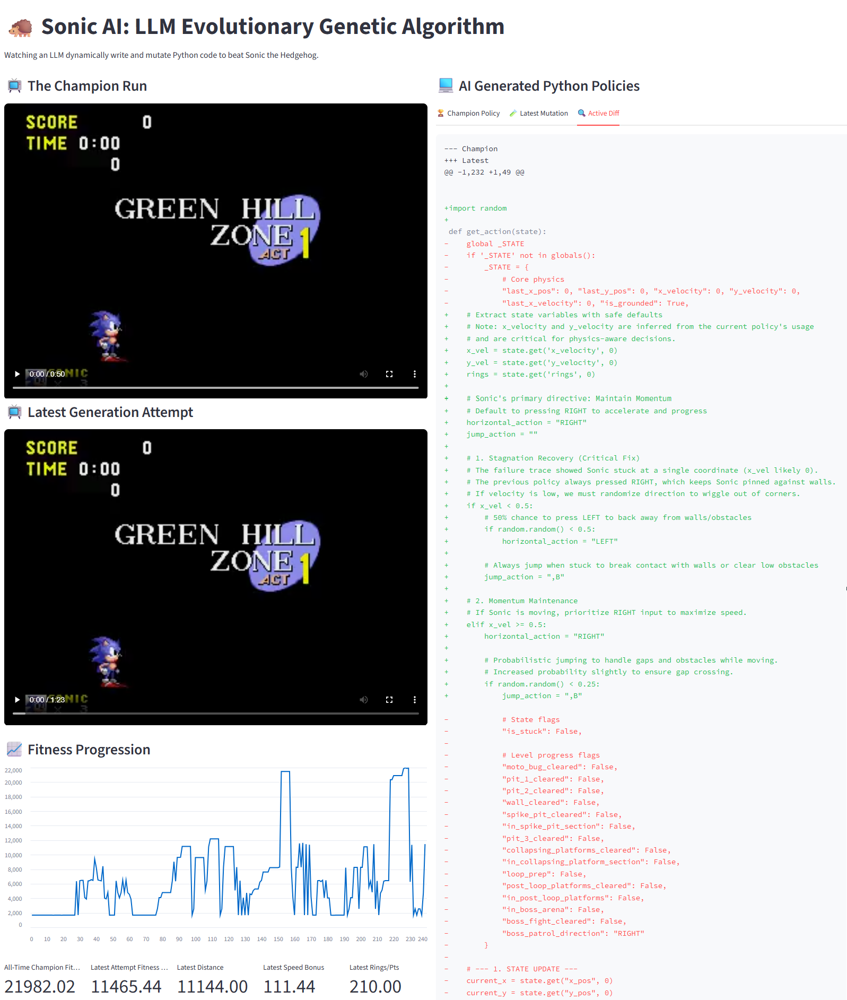

# Sonic LLM Mutator


This project uses a Large Language Model (LLM) as a genetic algorithm mutator to learn how to play Sonic the Hedgehog. The system leverages `stable-retro` as the emulator, decoupled via an MCP server, and employs a local CI/CD pipeline script to iteratively test and evolve the Python script that controls Sonic.

## Architecture

1.  **Emulator MCP Server (`emulator/`)**: Wraps `stable-retro` and exposes Sonic's game state (velocity, coordinates, surrounding tiles) as discrete tools.
2.  **LLM Mutator (`llm/`)**: Acts as the genetic mutation engine. It queries the MCP server when Sonic dies to understand the failure context, then rewrites the control policy. It routes heavy visual debugging to Google Gemini and minor tweaks to a local LLM via LM Studio.
3.  **Core Orchestrator (`core/` & `main.py`)**: Runs the current policy, calculates fitness (penalizing stagnation), and manages the automated evolutionary pipeline.
4.  **Policies (`policies/`)**: Contains the generated Python scripts that decide the button presses for each frame.
5.  **Web Dashboard (`dashboard.py`)**: A live Streamlit interface that tracks fitness progression and visually plays `.mp4` recordings of both the Champion and Latest mutation attempts.

## Resilience Features

To ensure the pipeline can run continuously without manual intervention:
1.  **Syntax Error Sandboxing**: The dynamic Python code loader is wrapped in error handling. If the LLM generates invalid code (e.g., a SyntaxError), the pipeline catches it, assigns the candidate a fitness score of `0.0`, and continues running seamlessly.
2.  **Stateful Emulator Recording**: We manually enforce video buffer flushing by calling an extra `env.reset()` before teardown, ensuring that `stable-retro` correctly writes the `.bk2` video files to disk even if the episode is manually terminated early.
3.  **Aggressive Cache Breaking**: Mutator prompts are seeded with a randomized cryptographically secure string to prevent local LLMs from entering endless prompt-caching loops.

## Setup

1.  Install dependencies:
    ```bash
    uv venv --python 3.8 venv
    .\venv\Scripts\Activate.ps1
    uv pip install -r requirements.txt
    ```
2.  Import the Sonic the Hedgehog ROM:
    ```bash
    python -m retro.import /path/to/your/roms
    ```
3.  Configure API keys in your environment:
    ```bash
    $env:GEMINI_API_KEY="your_api_key_here"
    ```
4.  Run the evolutionary pipeline:
    ```bash
    python main.py
    ```
5.  Run the live dashboard in a separate terminal:
    ```bash
    streamlit run dashboard.py
    ```
